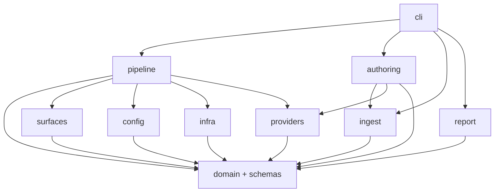
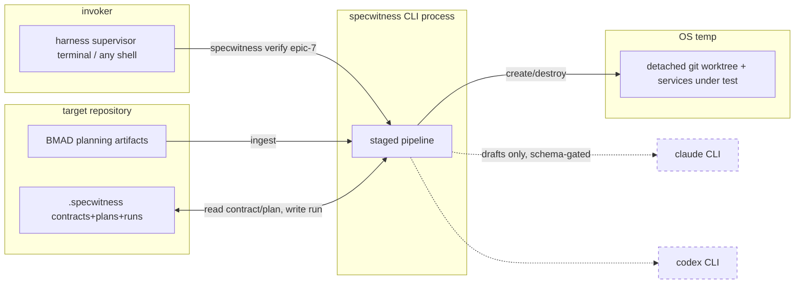

# Architecture Spine — SpecWitness

## Design Paradigm

**Hexagonal (ports & adapters) around a pure domain core.** The domain — EpicSpec, Contract, Plan, Run, Evidence, CriterionResult, verdict aggregation, error classification — is pure TypeScript: no I/O, no subprocesses, no clock/random access. Every side effect lives behind a port with adapters at the edge: `AgentProvider` (claude-code / codex / fake), `ProcessRunner`, `Vcs` (git/worktree), `RunStore`, `SurfaceExecutor` (http/browser/observation/shell), `Clock`/`Ids`. The `verify` command is an **explicit staged pipeline** (a state machine of named stages with early-stop semantics), not ad-hoc sequential code; contract/plan *authoring* flows (generate, freeze, amend, compile) are application services in `authoring/`, orchestrated by `cli/` before/outside the pipeline — the pipeline itself never authors. Layer map: `domain/` + `schemas/` (core) ← `pipeline/`, `authoring/`, `ingest/`, `report/` (application) ← `providers/`, `surfaces/`, `infra/`, `config/` (adapters) ← `cli/` (edge).

## Invariants & Rules

### AD-1 — Pure domain core; side effects only behind ports

- **Binds:** all
- **Prevents:** verdict/contract logic entangled with subprocess, git, or browser handling; untestable core; 7 parallel story agents each inventing their own I/O seam.
- **Rule:** nothing under `src/domain/` or `src/schemas/` may import from adapter layers or Node built-ins with side effects (`child_process`, `fs`, `net`). Dependency direction is enforceable and enforced (lint rule / dependency-cruiser check added in Epic 1). Adapters depend on the core; never the reverse.



### AD-2 — LLM authority boundary

- **Binds:** FR-7, FR-11..FR-18, FR-27
- **Prevents:** AI becoming the source of truth; free-form model text leaking into state; a provider "helpfully" weakening expectations.
- **Rule:** a provider response enters the system only through a versioned schema validation gate (`schemas/`), with bounded recorded retries (default 2) then a typed provider error. The schema-gate + retry loop is implemented **once**, in `providers/invoke.ts`, shared by all adapters; adapters only translate the common envelope to a CLI invocation and return raw text. The envelope is fixed: request `{role, prompt, responseSchema, contextFiles?}` → response `{ok, parsed?, raw, attempts[], durationMs}` — `parsed` exists only after the shared gate validated it. Providers may author **drafts** (contract draft, plan draft, explanation text) — never CriterionResults, never Verdicts, never mutations of frozen artifacts. Verdict aggregation is a pure function in `domain/` with no provider access. Runtime mechanics adaptation (FR-18) may alter probe *mechanics* fields only (locators, navigation); assertion and expected-value fields are structurally read-only in that flow.

### AD-3 — Trusted-command boundary (security invariant)

- **Binds:** FR-2, FR-20, FR-21, FR-23..FR-26; PRD §5 security non-goals
- **Prevents:** raw LLM output executing arbitrary shell; probes escaping the project's trust boundary.
- **Rule:** the only strings ever passed to a shell are values declared in Project Config (`setup`, `gates[].run`, `services[].run`, `data.*`, `observations[].run`). Plans reference executables **by config id** (e.g. `observation: company-count`), never by command string. Probe types are a closed union: `http`, `browser`, `observation`, `shell` (shell = config-id reference + argument allowlist). Provider-authored plan drafts are validated against this union; a draft containing an inline command string fails schema validation. No production URL defaults; services bind to localhost unless config says otherwise.

### AD-4 — Provider subprocess contract

- **Binds:** FR-12, FR-13, FR-15
- **Prevents:** credential scraping; assuming outdated CLI flags; accidental API billing; two adapters with incompatible invocation styles.
- **Rule:** adapters spawn only the official binaries (`claude`, `codex`) via `ProcessRunner`; capabilities (flags, non-interactive mode) are probed at runtime per session and cached, never hardcoded beyond a tested minimum (claude `-p --output-format json`; codex `exec --output-schema`). Adapters never read `~/.claude/`, `~/.codex/`, or any credential store; never persist credentials; auth-readiness checks use only the CLIs' own public commands/exit codes. In `subscription`/`chatgpt` mode the child environment is constructed by **withholding** billing-risk variables (`ANTHROPIC_API_KEY`, `OPENAI_API_KEY`, provider equivalents); the parent environment is never mutated. Every provider invocation is recorded (role, duration, retries) in run/generation metadata.

### AD-5 — Artifact formats & fingerprint

- **Binds:** FR-8..FR-10, FR-16, FR-30, FR-31
- **Prevents:** incompatible serialization between stories; unverifiable freeze; schema drift breaking the harness.
- **Rule:** Contracts and Plans are human-readable YAML in the target project (`.specwitness/contracts/<epic>.yaml`, `.specwitness/plans/<epic>.yaml`); Runs are JSON under `.specwitness/runs/<run-id>/`. Every artifact — run manifest included — carries `schemaVersion` (integer, additive evolution; breaking change ⇒ bump + migration note). A contract file has exactly two top-level keys: `spec` (criteria + epic ref + version — the fingerprinted content) and `meta` (fingerprint, frozen flag, timestamps, version history — **never** fingerprinted); freeze and integrity-validation both hash only `spec`, via the one shared `schemas/canonical.ts` implementation (stable key order, LF endings, trimmed strings). The `Criterion`, `Kind`, `Severity`, `Verifiability` types are defined once in `domain/contract.ts`; Plans reference criteria **by id only** and never embed criterion statements. Timestamps are ISO-8601 UTC everywhere.

### AD-6 — Result taxonomy & exit mapping

- **Binds:** FR-22, FR-27, FR-30
- **Prevents:** infra failures reported as product FAIL; ad-hoc exit codes; two stories disagreeing on status vocabulary.
- **Rule:** closed enums, defined once in `domain/`: `CriterionStatus = pass | fail | needs_human | skipped | error`; run outcome = `{ verdict: PASS | FAIL | NEEDS_HUMAN }` **or** `{ infraError }` (mutually exclusive); gate results are their own type, not criteria. Aggregation is one pure function taking **gate results + criterion results**: any gate failed ⇒ FAIL with `gateFailed` (ADR-003); else any criterion `fail` ⇒ FAIL; else any criterion `error` ⇒ infra error; else any `needs_human` ⇒ NEEDS_HUMAN; else PASS (a gates-only run with zero criteria and green gates is PASS). `GateFailure` is a **stage result**, not a thrown exception — the pipeline's aggregate stage is the only converter from stage results to the run outcome. Process exit mapping lives in exactly one `cli/exit.ts` table consuming only run outcomes + the AD-7 error hierarchy: PASS 0 · FAIL 1 · NEEDS_HUMAN 2 · infra/integrity/config/provider error 3 · usage error 64 (ADR-002).

### AD-7 — Error classification hierarchy

- **Binds:** FR-14, FR-22, FR-27
- **Prevents:** stories classifying the same failure differently; `catch (e) { fail() }`.
- **Rule:** one typed error hierarchy in `domain/errors.ts`: `UsageError`, `ConfigError`, `IngestError`, `IntegrityError` (fingerprint), `ProviderError`, `InfraError` (worktree/service/dependency). Gate failure is deliberately **not** in this hierarchy — it is a stage result handled by aggregation (AD-6). Every adapter maps its native failures into this hierarchy at the boundary; unclassified exceptions escalate to `InfraError` (fail closed — never silently PASS, never mislabeled as product FAIL). The exit-mapping table (AD-6) consumes only run outcomes and this hierarchy.

### AD-8 — Isolation & process lifecycle

- **Binds:** FR-19, FR-21, FR-27 (clean), PRD §5
- **Prevents:** verification mutating the invoking workspace; orphaned services/worktrees after crashes.
- **Rule:** verify resolves `--head` to a SHA and creates a detached git worktree under the OS temp dir — never inside the source repo's working tree; the source repo is treated read-only (worktree add/remove are the only git writes). Every spawned service/probe process starts in its own process group; a **run manifest** (`.specwitness/runs/<run-id>/manifest.json`, schema-versioned) records worktree paths and pgids *before* the resources exist-in-use; teardown kills process groups then removes worktrees; `specwitness clean` replays manifests to reap leftovers from crashed runs. **`RunStore` (infra) is the sole writer under `.specwitness/runs/<run-id>/`** and exposes exactly two write disciplines: crash-durable incremental appends (manifest updates — written+fsynced before resource use, so kill -9 never loses them) and atomic finalize (stage-and-rename for `result.json`); no other module touches run-directory paths. SpecWitness-generated files (scenarios, evidence, logs) live only in the run directory, never in the project working tree.

### AD-9 — Determinism & flakiness

- **Binds:** FR-17, FR-18, FR-32
- **Prevents:** LLM-fresh test data per run; hidden retries converting flake to PASS.
- **Rule:** deterministic test data is resolved at plan compile time and stored in the Plan; `Clock` and `Ids` are ports (injectable in tests); fields that legitimately vary per run are declared `volatile` in the plan and excluded from reproducibility comparison. Retries are opt-in per probe class, every attempt recorded in Evidence, and a retry-pass is surfaced as `flaky: true` in report and JSON — aggregation treats it as pass, visibility is mandatory.

### AD-10 — Evidence & redaction at capture

- **Binds:** FR-28, PRD §5
- **Prevents:** secrets persisted to run storage; unstructured LLM text as evidence.
- **Rule:** Evidence is a typed closed union (`http`, `browser` (trace/screenshot refs), `observation`, `command`, `gate`, `provider`); constructors in `domain/evidence.ts` apply redaction (Authorization/Cookie/Set-Cookie headers, `*_KEY`/`*_TOKEN`/`*_SECRET`/password-pattern values, config-declared extra patterns) **before** any persistence — render layers never re-redact. Free-form provider text may appear only in the optional `explanation` field, clearly labeled non-authoritative.

### AD-11 — One result model, many renderers

- **Binds:** FR-29, FR-30, FR-31
- **Prevents:** terminal report and JSON drifting apart; harness parsing human text.
- **Rule:** the pipeline produces a single `RunResult` domain object; the terminal renderer, JSON renderer (`--json`), and stored `result.json` all derive from it — no renderer computes its own facts. JSON schema is snapshot-tested. Terminal output is bounded: any log/body over the cap truncates with a pointer to the full file in the run directory.

### AD-12 — Testability seams [ADOPTED]

- **Binds:** FR-11, PRD §6.1 (Golden Corpus), brief §50–52
- **Prevents:** the test suite depending on subscriptions; corpus outcomes defined by the code under test.
- **Rule:** `FakeAgentProvider` implements the provider port for all domain/application tests; real-CLI adapter tests are a separate, optional, explicitly tagged suite. Golden Corpus fixtures live in `fixtures/corpus/<name>/` with a `expected.json` (expected verdict/classification) written by hand, never generated; corpus e2e tests are hermetic (no network beyond localhost, no real providers — precompiled contracts/plans checked into each fixture).

### AD-13 — Probe execution contract

- **Binds:** FR-23..FR-26, FR-27, FR-32
- **Prevents:** each surface story adjudicating CriterionStatus its own way; retries/flakiness computed inconsistently per surface; two producers of CriterionResult.
- **Rule:** a `SurfaceExecutor` executes one probe attempt and returns a `ProbeAttempt = {observations, assertionEvaluations[], evidence[], execError?}` — it evaluates assertions mechanically (assertions are data) but **never** produces a `CriterionStatus`. Deriving `CriterionResult` from one-or-more probes' attempts — including retry orchestration, `flaky` marking, and error classification — happens in exactly one pure function in `domain/criterion-result.ts`, called by the pipeline's probes stage. All four surfaces implement the same executor interface and result shape.

## Consistency Conventions

| Concern | Convention |
| --- | --- |
| Naming | CLI commands/flags kebab-case; TS files kebab-case; types/interfaces PascalCase; variables camelCase; YAML/JSON keys camelCase; criterion IDs canonical `E<n>-<NN>` — epic number unpadded, sequence zero-padded two digits (`E7-01`); PRD/brief examples like `E07-01` are illustrative, this row governs |
| Identifiers | epic input normalized (`7` ≡ `epic-7` ≡ `epic-07` → canonical `epic-7`) by `domain/ids.ts` — the only implementation, used by cli and ingest alike; run id `run-<YYYYMMDDTHHmmssZ>-<4 random base36>`; contract versions integer, monotonic |
| Data & formats | timestamps ISO-8601 UTC only; durations ms integers; all persisted artifacts carry `schemaVersion`; JSON stable-ordered via canonical serializer where fingerprinted |
| Errors & exit | user-facing failures print `ERROR: <what>` + `HINT: <how to fix>` to stderr (house style of client #1); exit codes only via `cli/exit.ts` table |
| State & config | no global mutable state; config loaded once, validated with zod, passed down; env vars read only in `cli/` and `infra/`; never mutate parent env |
| Logging | structured logger port; `--verbose` for debug; default output is the report, not logs |
| Non-interactive first | no code path may block on TTY input except commands documented interactive (`init` confirm, `contract --amend`); all agent-callable commands (`verify`, `plan`, `report`, `doctor`, `contract --status`) are prompt-free |

## Stack

| Name | Version |
| --- | --- |
| Node.js (runtime floor) | >=22.12 (Node 20 EOL 2026-04; commander 15 & execa 10 require >=22.12 — reviewer-verified) |
| TypeScript | 6.0.x (stable JS-compiler line; 5.9 branch ended, 7.x Go-compiler migration deferred) |
| pnpm (dev) | 11.x |
| commander | 15.x (14→15 breaking-change review in Epic 1 spike) |
| zod | 4.5.x |
| execa | 10.x (process-group/teardown semantics on macOS verified by Epic 3 story 3.2 tests — flagged by review) |
| yaml | 2.9.x |
| @playwright/test (optional peer; consumed as test runner over generated spec files) | 1.62.x |
| vitest | 4.1.x |
| tsup (build) | 8.5.x |
| dependency-cruiser (dev; AD-1 enforcement) | 18.x (requires Node >=22) |
| claude CLI (external, probed) | >=2.1.x (`-p`, `--output-format json`) |
| codex CLI (external, probed) | >=0.144.x (`exec`, `--output-schema`) |

## Structural Seed

```text
specwitness/
  src/
    domain/        # pure models: epic-spec, contract, plan, run, evidence, verdict, errors, ids, criterion-result
    schemas/       # versioned zod schemas, canonical serializer, fingerprint
    ingest/        # bmad-v6 reader -> EpicSpec (plugin seam for future sources)
    authoring/     # application services: contract generate/freeze/amend, plan compile
    config/        # project config load + validation
    providers/     # AgentProvider port; invoke.ts (shared schema-gate+retry); claude-code-cli, codex-cli, fake adapters
    pipeline/      # staged verify state machine: resolve -> integrity -> worktree ->
                   #   setup -> gates -> services -> data -> probes -> aggregate -> persist -> teardown
    surfaces/      # http, browser (playwright), observation, shell executors
    report/        # terminal renderer, json renderer (one RunResult in)
    cli/           # commander wiring, exit table, arg normalization
    infra/         # process-runner, git/worktree, run-store, clock, ids, logger
  fixtures/corpus/ # golden corpus fixture apps + hand-written expected.json
  tests/           # unit (domain), integration (adapters), e2e (corpus)
```



Deployment & environments: V0 ships as one npm package (`specwitness`) with a `bin` entry; executed on the developer's machine (macOS/Linux; Windows best-effort untested); no server, no daemon, no cloud. Target-project services run only inside the ephemeral worktree environment on localhost. Distribution: npm publish with provenance; semver; `next` dist-tag for pre-releases.

## Capability → Architecture Map

| Capability / Area | Lives in | Governed by |
| --- | --- | --- |
| FR-1..4 init/config/doctor/stack-independence | `cli/`, `config/`, `infra/` | AD-3, AD-4, conventions (non-interactive first) |
| FR-5..6 BMAD ingestion → EpicSpec | `ingest/` | AD-1 (seam), AD-5 |
| FR-7..10 contract generate/freeze/integrity/amend | `authoring/`, `domain/`, `schemas/` | AD-2, AD-5 |
| FR-11..15 providers & billing safety | `providers/` | AD-2, AD-4 |
| FR-16..18 plan compile, deterministic data, AI-free rerun | `authoring/`, `domain/`, `pipeline/` | AD-2, AD-3, AD-9 |
| FR-19..22 worktree, gates, services, classification | `pipeline/`, `infra/` | AD-6, AD-7, AD-8 |
| FR-23..26 probe surfaces | `surfaces/` | AD-3, AD-9, AD-10, AD-13 |
| FR-27..32 verdict, evidence, report, JSON, storage, flake | `domain/`, `report/`, `infra/` | AD-6, AD-9, AD-10, AD-11 |
| FR-33..34 scorecard | `cli/`, `infra/` (local files) | AD-11, local-first non-goal |
| Golden Corpus | `fixtures/corpus/`, `tests/` | AD-12 |

## Deferred

- **Differential BASE/HEAD execution engine** — run model already records base+head (AD-8); the comparison engine, dual-run orchestration, and BASE-fails/HEAD-passes semantics wait for v2. Reason: not needed to answer the north-star question.
- **Challenge/mutation verification** — no foundational piece required now beyond stable Plan/RunResult schemas. v2+.
- **Non-BMAD ingestion sources** — `ingest/` seam exists; additional readers wait for real demand.
- **MCP server / CI / GitHub status modes** — pure additional edges over `cli/`+`report/`; nothing in V0 precludes them.
- **Container isolation** — worktree + pgid lifecycle suffices for V0 (ADR-004); revisit if dogfooding shows env bleed.
- **SQL/native DB adapters** — observation commands own state reading in V0; adapter design waits for evidence it's insufficient.
- **TypeScript 7.x (Go compiler) migration** — pin 6.0.x (stable JS-compiler line) now; re-evaluate once 7.x is the settled ecosystem default.
- **Windows support hardening** — process-group semantics differ; explicitly untested in V0.
- **Persisting accepted browser scenarios into target projects** — ephemeral-only in V0; ownership/review questions deferred.
- **Cross-epic historical contract regression** — contract store shape (one file per epic) already accommodates it; execution model deferred.
