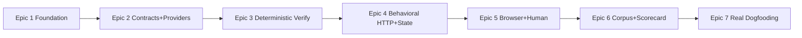

# SpecWitness — Implementation Roadmap

Companion to `epics.md` (full stories + GWT acceptance criteria there). Format per brief §72. Cohort model: one epic = one cohort, one story = one agent, supervisor reviews PRs, every PR leaves the repo coherent (backward-only dependencies inside each epic; waves gate parallelism).

## Dependency graph



Recommended cohort execution order: **E1 → E2 → E3 → E4 → E5 → E6 → E7**, one cohort per epic, sequentially. Within epics, launch agents in the waves below (a wave's stories are safe to run in parallel — disjoint module ownership; later waves consume the earlier waves' merged contracts).

---

EPIC 1 — Install, Configure & Diagnose

Purpose:
The npm package, CLI skeleton, pure domain taxonomy (statuses, errors, verdict aggregation, exit table), trusted config model, init/doctor, and run-storage foundation — the shared contracts every later cohort depends on (brief §62: stabilize before parallel work).

Stories:
- 1.1 CLI package skeleton with exit-code contract
- 1.2 Domain core — result taxonomy, errors, verdict aggregation
- 1.3 Project configuration model & validation
- 1.4 `specwitness init`
- 1.5 `specwitness doctor` — runtime & project diagnostics
- 1.6 Run storage foundation & run identifiers

Dependencies:
None (greenfield). Spine AD-1..AD-13 and PRD glossary are the upstream contracts.

Can run in parallel:
Wave B: 1.2 (src/domain, src/schemas) + 1.3 (src/config) · Wave C: 1.4 + 1.5 + 1.6 (separate commands/modules).

Must run sequentially:
1.1 first (repo bootstrap: package, build, CI, cli/exit.ts) → wave B → wave C.

Shared contracts that must already be stable:
From the spine only: AD-6 enums, AD-7 error hierarchy, exit table (ADR-002), config key shapes (addendum §D as starting point).

Exit criteria:
- `npx specwitness --help|init|doctor` work from a packed tarball; exit codes 0/3/64 demonstrated.
- Verdict aggregation + exit mapping fully unit-tested; dependency-cruiser AD-1 check green in CI.
- Doctor reports runtime + config checks with `--json`; config validation errors name YAML paths.

EPIC 2 — Verification Contracts from BMAD Epics

Purpose:
The product's trust core: BMAD → EpicSpec → provider-drafted criteria → human freeze with fingerprint → tamper detection → explicit amendment. Both CLI adapters, roles, fake provider, structured-output gate, billing safety.

Stories:
- 2.1 BMAD v6 ingestion to EpicSpec
- 2.2 Contract model, canonical serialization & fingerprint
- 2.3 AgentProvider port, roles & structured-output gate
- 2.4 Claude Code CLI adapter
- 2.5 Codex CLI adapter
- 2.6 `specwitness contract <epic>` — generate/review/freeze/status
- 2.7 Amendment flow, runtime integrity & provider doctor checks

Dependencies:
Epic 1 (CLI, config, domain errors, doctor registry).

Can run in parallel:
Wave A: 2.1 (src/ingest) + 2.2 (domain/contract + schemas/canonical) + 2.3 (providers port + invoke.ts + fake) · Wave B: 2.4 + 2.5 (adapter files, symmetric) + 2.6 (src/authoring + contract command).

Must run sequentially:
Waves A → B → 2.7 (touches contract command + doctor + adapters).

Shared contracts that must already be stable:
AD-2 provider envelope, AD-5 spec/meta partition + criterion id format `E<n>-<NN>`, EpicSpec type (2.1's wave-A merge), Kind/Severity/Verifiability enums.

Exit criteria:
- Real BMAD epic (both layout variants) → draft contract → freeze → fingerprint printed; tamper → IntegrityError.
- Claude-only and Codex-only configurations each complete generation (integration tests with mocked binaries; one tagged real-CLI smoke test).
- Malformed provider output → bounded recorded retries → ProviderError; no partial artifacts. No code path reads credential stores.

EPIC 3 — Isolated Deterministic Verification

Purpose:
`specwitness verify` as a real (gates-only) merge gate: worktree isolation, process-group lifecycle + crash-safe manifests + `clean`, staged pipeline with classification, run persistence, terminal/JSON reports, exit codes end-to-end.

Stories:
- 3.1 Revision resolution & isolated worktree
- 3.2 Process groups, run manifest & `specwitness clean`
- 3.3 Staged pipeline state machine
- 3.4 Deterministic gates execution
- 3.5 RunResult persistence & `specwitness report`
- 3.6 Terminal & JSON renderers
- 3.7 End-to-end gates-only verify

Dependencies:
Epic 2 (frozen contracts gate verify; integrity check at runtime).

Can run in parallel:
Wave A: 3.1 (infra/git) + 3.2 (infra/process-runner **lifecycle extension** — the file already exists from story 2.3, which created it minimally; 3.2 owns process groups, teardown and `clean` — plus the run-store manifest side) + 3.3 (src/pipeline over faked stages; also lands RunResult + SurfaceExecutor/ProbeAttempt domain types) · Wave B: 3.4 (gates stage) + 3.5 (persistence + report cmd) + 3.6 (src/report).

Must run sequentially:
Waves A → B → 3.7 (integration story).

Shared contracts that must already be stable:
AD-6 aggregation incl. gateFailed, AD-7 hierarchy, AD-8 manifest discipline (RunStore sole writer), RunResult shape (3.3's merge gates wave B), result.json schemaVersion.

Exit criteria:
- Fixture: green gates → PASS exit 0; broken build → FAIL+gateFailed exit 1; corrupt ref → InfraError exit 3 (three-way classification live).
- kill -9 mid-run leaves source repo untouched; `clean` reaps worktree + processes (macOS + Linux CI).
- `--json` stdout parseable and byte-equal to persisted result.json; JSON snapshot test in CI.

EPIC 4 — Behavioral Verification over HTTP & State

Purpose:
Contract → compiled executable Plan (deterministic data, lowest adequate surface) → services with readiness → HTTP/observation/shell probes with redacted evidence → criterion results → full mechanical verdict — rerunnable with zero AI calls.

Stories:
- 4.1 Service lifecycle & readiness
- 4.2 Plan model & compilation via plan-author provider
- 4.3 Deterministic test data
- 4.4 HTTP probe executor
- 4.5 Observation probes & before/after invariants
- 4.6 Shell probes
- 4.7 AI-free behavioral verify end-to-end

Dependencies:
Epic 3 (pipeline, manifests, renderers); Epic 2 (providers for plan-author).

Can run in parallel:
Wave A: 4.1 (pipeline services stage) + 4.2 (authoring/plan + plan schema) · Wave B: 4.3 (domain data binding) + 4.4 + 4.5 + 4.6 (one surface executor each — disjoint files under src/surfaces/, all implementing the AD-13 interface from Epic 3).

Must run sequentially:
Waves A → B → 4.7 (integration story wiring probes stage + criterion-result derivation).

Shared contracts that must already be stable:
Plan schema incl. closed probe union + criteria-by-id (4.2's merge gates wave B), AD-13 ProbeAttempt/SurfaceExecutor, AD-3 config-id command referencing, AD-10 evidence union + redaction constructors.

Exit criteria:
- Fixture app verified end-to-end with providers disabled (0 provider calls recorded): PASS on correct app, FAIL with expected/actual + evidence on defective app.
- Duplicate-submission invariant fails via before/after observation; seeded-secret test proves redaction.
- Malicious fake plan-author (inline shell string / mutated assertion) rejected at schema gate.

EPIC 5 — Browser Verification & Human Judgment

Purpose:
Playwright-based browser probes with trace evidence and correct failure classification; honest NEEDS_HUMAN flow; recorded retry/flake semantics; optional non-authoritative explainer and mechanics-adaptation.

Stories:
- 5.1 Playwright integration & environment resolution
- 5.2 Browser probe executor with trace evidence
- 5.3 Human-judgment criteria flow
- 5.4 Flakiness & retry semantics
- 5.5 Failure explanation (explainer role) — optional
- 5.6 Mechanics adaptation boundary — optional

Dependencies:
Epic 4 (probe framework, plan schema, criterion-result derivation).

Can run in parallel:
Wave B: 5.2 + 5.3 + 5.4 (surfaces/browser vs domain/report vs domain/criterion-result — disjoint) · Wave C: 5.5 + 5.6 (optional, independent).

Must run sequentially:
5.1 first (environment resolution 5.2 builds on) → wave B → wave C.

Shared contracts that must already be stable:
AD-13 executor interface, browser probe schema fields (mechanics vs assertions split — needed by 5.6's structural immutability), evidence union entries for trace/screenshot.

Exit criteria:
- UI-level fixture verified via generated ephemeral spec; trace + screenshot land in run evidence; assertion-fail vs browser-crash classify differently.
- Subjective criterion → NEEDS_HUMAN, exit 2, reviewer guidance in report.
- Retry-pass surfaces `flaky: true` everywhere (report, JSON, scorecard fields); never silent.

EPIC 6 — Trust: Golden Corpus & Dogfooding Scorecard

Purpose:
SpecWitness's own proof: hermetic e2e corpus with hand-written expected outcomes pinning every verdict/classification (including non-Node), plus the local scorecard and attribution needed to measure product value. This is the first epic that VERIFIES the assembled product rather than adding a stage to it, and the first that runs on Linux.

Stories:
- 6.1 Corpus infrastructure & hermetic e2e runner  (+ riders: e5-C depcruise rule for src/authoring/**, e3-G pre-registration window, loud reporting of skipped suites in CI)
- 6.2 Behavioral corpus fixtures (PASS/FAIL classes)  (+ riders: e2-5a-i fenceMask, e2-B3 addendum §B)
- 6.3 Classification corpus fixtures  (+ riders: e3-D gateFailed prose, e3-F SIGINT messaging, ADR-008 reader branch)
- 6.4 Non-Node target fixture
- 6.5 Scorecard recording  (bound by ADR-008)
- 6.6 Defect attribution & summary
- 6.7 Dogfooding readiness — docs & packaging  (+ rider: e5-E `report --explain` decision)
- 6.8 Shared prompt-assembly helper  (retires e5-A)
- 6.9 Browser verification in CI  (non-blocking; added 2026-09-04)

Dependencies:
Epics 1–5 (corpus exercises the full pipeline). ADR-008 (persisted-envelope strictness) is decided BEFORE wave 1 and binds 6.5.

Execution shape (owner decision 2026-09-04, following Epic 5's proven rhythm):
THREE WAVES against one long-lived epic branch `epic/6-golden-corpus-and-scorecard`, with `--supervisor-stage 4` (a supervisor that may merge story PRs into the epic). Epic 5 answered e4-A affirmatively: merge latency fell from ~7h43m of dead critical path to under a minute across six merges, at a reporting cost the supervisor must carry deliberately.

  wave 1: 6.1 alone                      — the runner contract every fixture plugs into, + CI wiring
  wave 2: 6.2, 6.3, 6.4, 6.5, 6.8, 6.9   — six agents, disjoint ownership
  wave 3: 6.6, 6.7                       — closes the epic (retro + integration PR)

Can run in parallel:
Wave 2's six stories own disjoint trees: three fixture directories under fixtures/corpus/ (6.2, 6.3, 6.4), the scorecard module under src/pipeline + src/schemas + src/cli/commands (6.5), src/authoring/** (6.8), and one additive CI job (6.9). The single shared file is .github/workflows/ci.yml — 6.1 wires it in wave 1, 6.9 adds a job to it, and 6.4 may add a runtime line; all three changes are additive and announced at intent-sync.

Must run sequentially:
6.1 first — it defines `expected.json`, the hermetic runner and the CI job that every wave-2 fixture plugs into. Then wave 2. Then 6.6 (needs 6.5's record shape) + 6.7 (docs must reflect final behaviour, and 6.7 is the last word on the packaged tarball).

Shared contracts that must already be stable:
result.json schema (frozen by snapshot tests), exit codes, corpus `expected.json` format (6.1's merge), scorecard.jsonl record shape (6.5's merge, under ADR-008).

CI — CHANGED THIS EPIC:
CI executes for the first time in the project's life (commit `fa2647b`, 2026-09-04: Node floor raised to 22.13, triggers restored; the repository became public so Actions minutes no longer apply). This ANSWERS action item e3-E after five epics. Consequences for Epic 6:
- Corpus e2e becomes a REQUIRED check (6.1's AC), on ubuntu-latest and macos-latest.
- Linux runs the process-group, worktree and pipeline code for the first time. Expect findings; they are the point.
- Fixtures stay hermetic: localhost only, FakeAgentProvider or checked-in artifacts, ZERO real `claude`/`codex` invocations and no network. Real-provider verification remains Epic 7's dogfooding job.
- CI's green does NOT currently mean everything ran: five merged browser suites self-skip on every runner (`describeWithBrowser`, because `@playwright/test` is an optional peer and nothing downloads chromium). 6.1 makes that visible; 6.9 fixes it with a NON-BLOCKING chromium job on Linux, carrying a written promotion criterion the owner flips later. This also gives story 5.1's provisioning path its first real execution.
- Every spec's "no CI has ever run" paragraph is deleted and inverted. An agent reporting CI as pending-owner in this epic is reporting a stale fact.

Exit criteria:
- All corpus fixtures produce their hand-written expected outcomes in CI on both platforms (SM-5: zero misclassifications); the infra-error fixture never reports FAIL and the gate-failure fixture never reports InfraError.
- `scorecard summary` computes the north-star metric from local records only, and reports its skipped-record count (ADR-008 §5).
- README + harness integration guide complete; `npm publish --dry-run` tarball verified and `npx specwitness --help` works from it.
- The five browser suites execute in CI on Linux rather than skipping, in a non-blocking job with a proposed promotion criterion.
- Every Epic 5 action item is either retired, scheduled, or explicitly carried with a reason recorded in the retrospective.

EPIC 7 — Real Dogfooding & Value Measurement

Purpose:
Product validation on real work (brief §66–67): gate an actual harness-produced epic end-to-end and answer the hypothesis with evidence. Operator-led.

Stories:
- 7.1 Harness integration & first real contract
- 7.2 First real epic verification & repair loop
- 7.3 Hypothesis verdict report

Dependencies:
Epic 6 (shipped, corpus-proven tool); a real harness project with a planned BMAD epic. **Author-selected target (2026-08-30): a new test feature in `/Users/jundymek/dev/gitnebula`** (pnpm monorepo, BMAD already installed, harness-style `docs/planning-artifacts` layout, ready-made lint/typecheck/test/build gates). When picking the feature, prefer one with an observable surface (something that runs and can be probed); a pure-CLI feature exercises shell/observation probes only.

Can run in parallel:
Nothing — single operator thread.

Must run sequentially:
7.1 → 7.2 → 7.3.

Shared contracts that must already be stable:
Everything shipped in E1–E6; harness allowlist entry `Bash(specwitness *)`.

Exit criteria:
- One real epic gated: contract frozen before cohort, verify drove the merge decision, evidence inspected (brief §67.17).
- Every finding attributed (unique/duplicate/false-positive); `docs/dogfooding-report-001.md` states the hypothesis verdict and next-step recommendation (§67.18).

======================================================================
MVP READY WHEN
======================================================================

- All 18 success criteria of brief §67 demonstrated — 1–16 by Golden Corpus + CI on Epics 1–6, 17–18 by Epic 7's real-epic run and dogfooding report.
- Exit codes and result.json schema frozen (snapshot-tested), documented, and consumed successfully by the harness supervisor flow.
- Corpus proves the four-way outcome separation (PASS / FAIL / NEEDS_HUMAN / infra error) with zero misclassifications, including the tampered-fingerprint and AI-free-rerun fixtures.
- A verify run leaves no trace: source repo untouched, no orphan processes/worktrees, even after kill -9 (tested).
- `scorecard summary` answers the north-star question ("unique real defects found after earlier gates passed") from local data.

======================================================================
DO NOT BUILD YET
======================================================================

- SaaS, cloud, accounts, billing, dashboards, web UI, hosted execution, browser farms.
- GitHub App / status checks, GitLab CI, MCP server, Cursor/other-harness integrations.
- Automated repair agents (outputs are repair-ready; agents are the harness's job).
- Differential BASE/HEAD execution engine (runs already record base+head — v2).
- Challenge/mutation verification (`specwitness challenge`) — v2+ differentiator.
- Historical-contract regression suite execution; non-BMAD ingestion sources; SQL/native DB adapters; container isolation; Windows hardening; direct Anthropic/OpenAI APIs; TypeScript 7.x migration.

======================================================================
FIRST REAL DOGFOODING PROCEDURE
======================================================================

Target: the next real epic (example: epic 12) in a harness-managed project, base branch `master`, epic branch `epic/12-invoicing`.

1. **One-time setup** (operator terminal, project root):
   ```bash
   npm install -D specwitness
   npx specwitness init
   # edit .specwitness/config.yaml: planning roots (docs/planning-artifacts,
   # docs/implementation-artifacts), gates, services+ports+readiness,
   # observations, ai.roles (e.g. contract-author: codex)
   npx specwitness doctor          # fix every fail; consciously accept warns
   ```
   Add `Bash(specwitness *)` to the harness's agent-settings allowlist.

2. **BMAD planning done → contract BEFORE cohort** (operator terminal):
   ```bash
   npx specwitness contract epic-12          # draft from BMAD artifacts
   $EDITOR .specwitness/contracts/epic-12.yaml   # review; fix criteria; mark human-only ones
   npx specwitness contract epic-12 --freeze # fingerprint printed
   npx specwitness plan epic-12              # compile executable plan
   git add .specwitness && git commit -m "specwitness: freeze contract for epic-12"
   ```

3. **Launch the coding cohort** as usual. Story PRs → Codex review → supervisor review → operator merges each into `epic/12-invoicing`.

4. **Gate the assembled epic** (supervisor terminal — invocation location only; execution is isolated):
   ```bash
   npx specwitness verify epic-12 --root "$PROJECT_ROOT" \
     --base master --head origin/epic/12-invoicing --json
   ```
   Exit 0 → step 7. Exit 1 → step 5. Exit 2 → step 6. Exit 3 → fix environment/config (it is NOT a product failure), rerun.

5. **Repair loop:** inspect `.specwitness/runs/<run-id>/` (report, evidence, traces):
   ```bash
   npx specwitness report epic-12
   ```
   Create one repair task per failed criterion, feeding each agent the criterion statement + expected/actual + evidence paths from result.json. Repair PRs go through the normal supervisor flow into the epic branch, then **rerun step 4** (AI-free — plan already compiled).

6. **NEEDS_HUMAN:** review each listed criterion against its guidance/evidence yourself; if satisfied, treat as approved and proceed (record the decision in the run notes).

7. **Merge & measure:**
   ```bash
   git merge --no-ff epic/12-invoicing   # or the usual PR flow into master
   npx specwitness scorecard add <run-id> --criterion E12-03 --attribution unique
   npx specwitness scorecard summary
   ```
   Attribute every finding (unique / duplicate / false-positive), then write `docs/dogfooding-report-001.md` with the hypothesis verdict.
